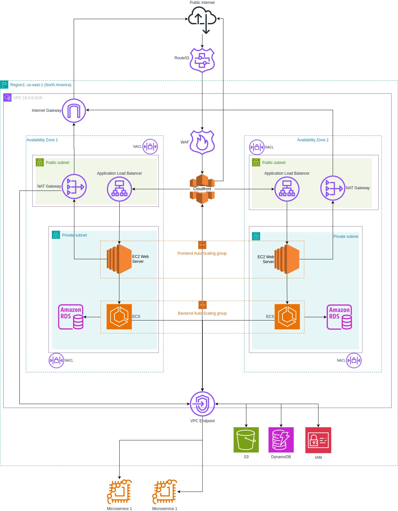

# Descripción y Justificación de la Arquitectura

La arquitectura diseñada para esta aplicación web en AWS combina **alta disponibilidad (HA)**, **escalabilidad** y **seguridad** para soportar cargas variables y garantizar un rendimiento óptimo. A continuación, se describen y justifican las decisiones clave de la arquitectura:

## Frontend: CloudFront + S3 + EC2 Web Servers
El contenido estático (CSS, JavaScript, imágenes) se almacena en un bucket de **Amazon S3**, optimizado para la entrega global mediante **Amazon CloudFront**. Esto reduce la latencia al aprovechar los puntos de presencia de CloudFront cercanos a los usuarios finales. Adicionalmente, un **grupo de Auto Scaling de servidores web (EC2)** en subredes privadas maneja el contenido dinámico del frontend. Esto permite una separación de responsabilidades entre contenido estático y dinámico, optimizando el rendimiento y los costos.

## Backend: Amazon ECS
El backend se despliega en **Amazon ECS** dentro de un **Auto Scaling Group**, distribuyendo las tareas en múltiples zonas de disponibilidad (AZs). Esto garantiza escalabilidad y alta disponibilidad para manejar el procesamiento de datos y las solicitudes dinámicas. ECS, además, es rentable y simplifica la administración mediante su integración con otros servicios de AWS.

## Bases de Datos: Amazon RDS y DynamoDB
La base de datos relacional utiliza **Amazon RDS** con configuración Multi-AZ para garantizar disponibilidad y redundancia. Para datos no estructurados o de acceso rápido, se integra **Amazon DynamoDB**, que opera fuera de la VPC como servicio administrado. Esta combinación permite manejar datos estructurados y no estructurados de forma eficiente y escalable.

## Conexión a Microservicios Externos
La arquitectura permite que el backend, alojado en subredes privadas, se comunique con los microservicios externos mediante **NAT Gateways** y **VPC Endpoints**. Esto asegura una conexión segura y eficiente, sin exponer directamente los recursos internos a Internet.

## Capa de Seguridad
La seguridad es un pilar clave en esta arquitectura:
- **AWS WAF (Web Application Firewall)** protege la aplicación contra ataques comunes como SQL Injection.
- **Grupos de Seguridad** restringen el acceso a recursos sensibles como RDS y ECS, permitiendo únicamente tráfico autorizado.
- **Network ACLs** (NACLs) controlan el tráfico entrante y saliente a nivel de subred.

## Justificación General
Esta arquitectura aprovecha las mejores prácticas del **AWS Well-Architected Framework**, ofreciendo:
- **Escalabilidad**: Auto Scaling de frontend y backend permite manejar picos de carga de forma eficiente.
- **Alta disponibilidad**: La distribución en múltiples AZs asegura resiliencia ante fallos.
- **Optimización de costos**: CloudFront y S3 reducen costos de almacenamiento y entrega de contenido estático, mientras ECS maneja dinámicamente la carga del backend.
- **Seguridad**: La segmentación en subredes públicas y privadas, junto con NAT Gateways y VPC Endpoints, garantiza que los recursos sensibles estén protegidos.

Este diseño es modular y adaptable, permitiendo el crecimiento y cambios futuros según los requerimientos del negocio.
